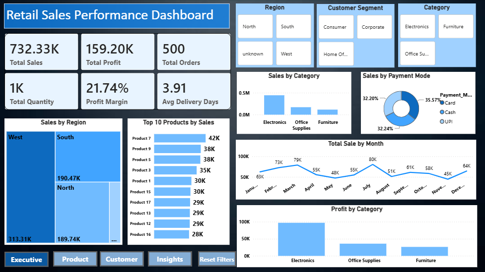
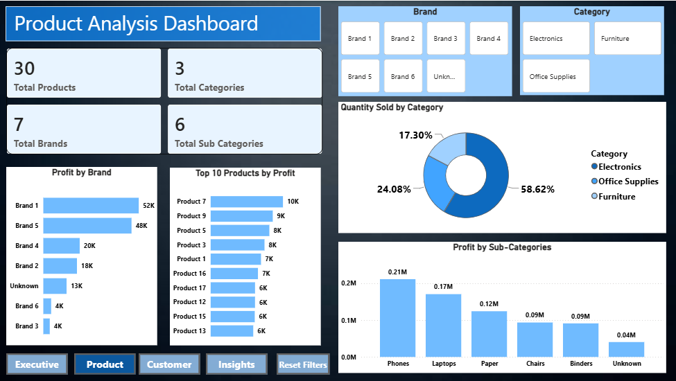
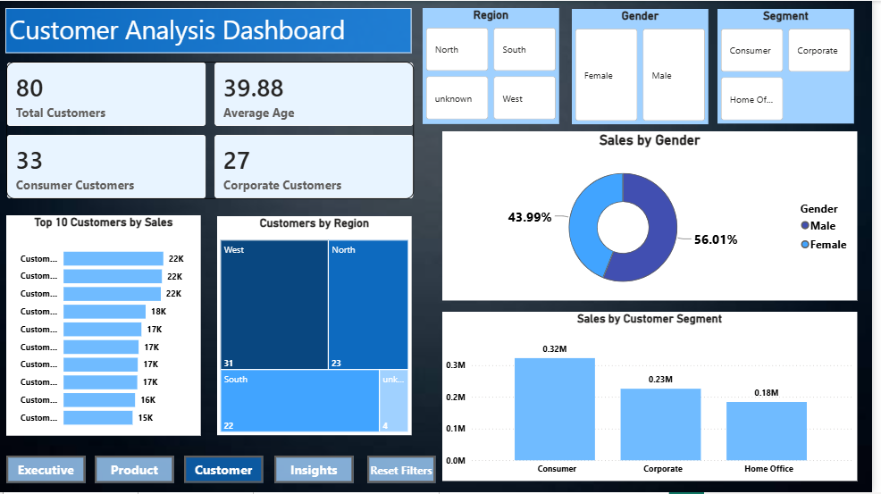
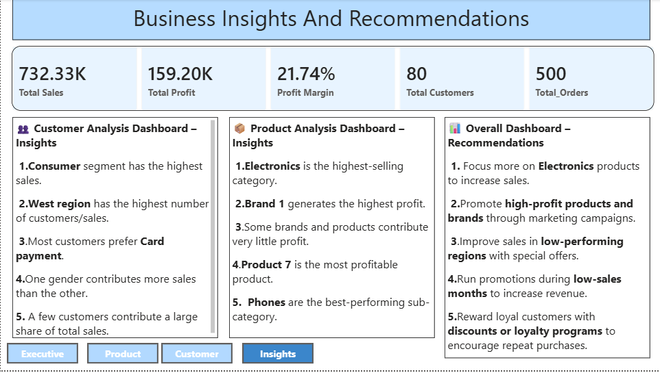

# 📊 Retail Sales Performance Dashboard

## 📌 Project Overview

This project is an interactive Power BI dashboard developed to analyze retail sales performance, customer behavior, and product performance. It helps businesses monitor KPIs, identify sales trends, analyze customer segments, evaluate product performance, and generate business insights for better decision-making.

---

## 🎯 Project Objectives

- Analyze overall sales and profit performance.
- Track monthly sales trends.
- Identify top-performing products and brands.
- Analyze customer behavior and segments.
- Generate business insights and recommendations.
- Build an interactive dashboard for business users.

---

## 🛠️ Tools & Technologies Used

- Power BI Desktop
- Power Query
- DAX (Data Analysis Expressions)
- Data Modeling
- CSV Files

---

## 📂 Dataset Information

The project uses three related datasets:

### Orders.csv
Contains sales transaction details.

Columns include:
- Order ID
- Order Date
- Customer ID
- Product ID
- Sales
- Profit
- Quantity
- Payment Mode
- Delivery Days

### Customers.csv
Contains customer information.

Columns include:
- Customer ID
- Customer Name
- Gender
- Age
- Segment
- Region

### Products.csv
Contains product information.

Columns include:
- Product ID
- Product Name
- Category
- Sub-Category
- Brand

---

## 🧹 Data Cleaning (Power Query)

The following data cleaning steps were performed:

- Removed duplicate records
- Removed blank values
- Trimmed extra spaces
- Standardized text values
- Corrected data types
- Renamed columns
- Verified data quality

---

## 🔗 Data Modeling

A Star Schema was created using three tables.

Relationships:

- Customers → Orders
- Products → Orders

This model improves report performance and enables accurate filtering across visuals.

---

# 📊 Dashboard Pages

## 1️⃣ Executive Dashboard

Features:

- Total Sales KPI
- Total Profit KPI
- Total Orders KPI
- Total Quantity KPI
- Profit Margin KPI
- Average Delivery Days
- Monthly Sales Trend
- Sales by Category
- Sales by Region
- Sales by Payment Mode
- Top 10 Products by Sales
- Interactive Slicers
- Navigation Buttons
- Reset Filters Button

---

## 2️⃣ Product Analysis Dashboard

Features:

- Total Products
- Total Categories
- Total Brands
- Total Sub Categories
- Top 10 Products by Profit
- Profit by Brand
- Sales by Sub-Category
- Quantity Sold by Category
- Product Filters

---

## 3️⃣ Customer Analysis Dashboard

Features:

- Total Customers
- Average Customer Age
- Consumer Customers
- Corporate Customers
- Sales by Customer Segment
- Sales by Gender
- Customers by Region
- Top Customers by Sales
- Customer Filters

---

## 4️⃣ Business Insights & Recommendations

This page summarizes key business findings and recommendations based on dashboard analysis.

---

# 📈 Key Insights

### Executive Dashboard

- Electronics is the highest-selling category.
- Card is the most preferred payment method.
- West region generates the highest sales.
- Monthly sales vary throughout the year.
- The business maintains a healthy profit margin.

### Product Analysis

- Product 7 is the highest-profit product.
- Brand 1 generates the highest profit.
- Phones are the best-performing sub-category.
- Some brands contribute very little profit.
- Electronics performs better than other categories.

### Customer Analysis

- Consumer segment contributes the highest sales.
- West region has the highest customer base.
- Card payment is preferred by most customers.
- A few customers contribute a large share of total sales.
- Customer behavior varies by segment and region.

---

# 💡 Business Recommendations

- Increase inventory for high-performing products.
- Focus marketing on Electronics products.
- Improve sales in low-performing regions.
- Run promotional campaigns during low-sales months.
- Reward loyal customers through loyalty programs.

---

# 📸 Dashboard Screenshots

## Executive Dashboard



---

## Product Analysis Dashboard



---

## Customer Analysis Dashboard



---

## Business Insights



---

# 📁 Repository Structure

```
Retail-Sales-Performance-Dashboard
│
├── Retail_Sales_Performance_Dashboard.pbix
├── README.md
├── Data
│   ├── Orders.csv
│   ├── Customers.csv
│   └── Products.csv
│
└── Images
    ├── Executive_Dashboard.png
    ├── Product_Analysis.png
    ├── Customer_Analysis.png
    └── Business_Insights.png
```

---

# 🚀 How to Use

1. Download the repository.
2. Open the `.pbix` file in Power BI Desktop.
3. Refresh the data if required.
4. Explore the interactive dashboards using the slicers and navigation buttons.

---

# 👩‍💻 Author

**Rutuja Dhondiram Patil**

Aspiring Data Analyst

Skills:
- Excel
- SQL
- Power BI
- Python
- Statistics

---

⭐ If you found this project useful, feel free to star the repository.
